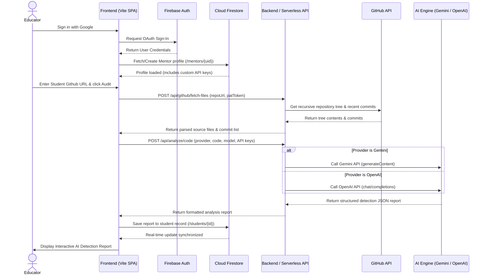

# Sentinel AI - Academic Code Integrity Suite

Sentinel AI is a modern forensic analysis platform designed for educators to audit public student GitHub repositories for AI-generated code patterns. Powered by Google Gemini (3.5 Flash, 3.1 Flash Lite, 3.1 Pro) and OpenAI (GPT-4o, GPT-4o-mini), the app parses repository structures, scans commit histories, and runs deep style inspections to flag structural irregularities, over-explained comments, and machine-generated templates.

---

## Key Features
- 🔐 **Secure Google Auth Gating**: Educators log in securely; their work is isolated in a private database.
- 🤖 **Multi-LLM Dual Support**: Seamlessly toggle between Google Gemini and OpenAI.
- 📊 **Dynamic Statistics Dashboard**: Visualize overall class risk distribution and average AI scores.
- 📁 **GitHub Source File Parsing**: Fetches, filters, and prioritizes primary code files from public repositories.
- 💡 **Interactive Reports & Code Walkthrough**: Real-time line-by-line annotations detailing suspected AI constructs vs. human signatures.
- 🧪 **Paste Sandbox**: Instantly run ad-hoc audits on raw text snippets.
- ☁️ **Vercel & Serverless Ready**: Fully configured for static serving and serverless edge functions.

---

## Core Application Flow

The diagram below outlines the interaction between the educator, the React frontend, Firebase, the Node/Express backend, and the LLM APIs during authentication and repository analysis.



---

## Project Structure

```
├── api/                     # Serverless endpoints for Vercel deployment
│   └── index.ts             # Serverless Express app wrapper
├── src/                     # React Client source
│   ├── components/          # React components (TokenSettings, StudentList, ReportViewer, etc.)
│   ├── types.ts             # TypeScript interface definitions (Student, Report, etc.)
│   ├── firebase.ts          # Firebase SDK initialization
│   └── main.tsx             # Application entrypoint
├── firestore.rules          # Firestore granular security rules
├── firebase-blueprint.json  # Firestore schema documentation
├── vercel.json              # Vercel deployment routes and rewrites config
├── server.ts                # Local development Express server
├── package.json             # Build commands and dependency listings
└── tsconfig.json            # TypeScript compiler configuration
```

---

## Local Development Setup

### Prerequisites
- **Node.js** (v18 or higher)
- A **Firebase Project** with Authentication (Google Provider) and Firestore enabled.

### 1. Install Dependencies
Clone the repository and run:
```bash
npm install
```

### 2. Configure Environment Variables
Create a `.env.local` file at the root:
```bash
# Gemini API Key (Optional if you enter it in the web UI)
GEMINI_API_KEY="YOUR_GEMINI_API_KEY"

# OpenAI API Key (Optional if you enter it in the web UI)
OPENAI_API_KEY="YOUR_OPENAI_API_KEY"

# Local client port configuration
APP_URL="http://localhost:5173"
```

### 3. Update Firebase Credentials
Open [`firebase-applet-config.json`](file:///c:/Coding/ai-code-detector/firebase-applet-config.json) and enter your Firebase web app keys:
```json
{
  "projectId": "YOUR_PROJECT_ID",
  "appId": "YOUR_APP_ID",
  "apiKey": "YOUR_API_KEY",
  "authDomain": "YOUR_PROJECT_ID.firebaseapp.com",
  "firestoreDatabaseId": "(default)",
  "storageBucket": "YOUR_PROJECT_ID.firebasestorage.app",
  "messagingSenderId": "YOUR_MESSAGING_SENDER_ID"
}
```

### 4. Firestore Security Rules & Indexes
- Go to the **Rules** tab under **Firestore Database** in the Firebase Console. Copy and publish the rules from [`firestore.rules`](file:///c:/Coding/ai-code-detector/firestore.rules).
- Create a composite index in Firestore to allow student list sorting. You can create it manually under **Indexes** or click the direct creation link outputted in your browser console on the first page load.
  - **Collection**: `students`
  - **Fields**: `mentorId` (Ascending) and `createdAt` (Descending)

### 5. Launch the Application
Start the development server:
```bash
npm run dev
```
Open **`http://localhost:3000`** in your browser.

---

## Vercel Cloud Deployment

This codebase is pre-configured to run as a Vercel Serverless Application:

1. **Push your code** to a GitHub repository.
2. Log in to [Vercel](https://vercel.com/) and click **Add New Project**.
3. Import your GitHub repository.
4. (Optional) Under **Environment Variables**, add:
   * `GEMINI_API_KEY`
   * `OPENAI_API_KEY`
5. Click **Deploy**.
6. Once deployed, copy your production domain (e.g. `your-app.vercel.app`) and add it to the **Authorized domains** list in the Firebase console (**Authentication** > **Settings** > **Authorized domains**).
